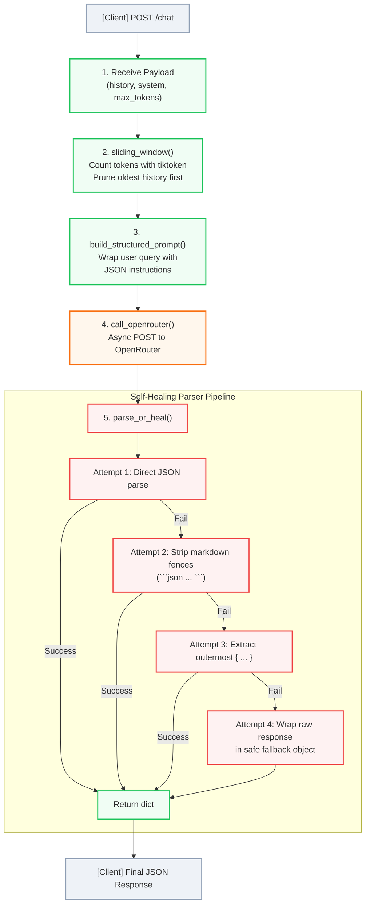

# Prism Gateway Engine

A FastAPI service that wraps LLM API calls with token-aware context
management, structured prompt enforcement, and self-healing JSON parsing.

## What it does
- Counts tokens locally before sending any request (tiktoken, o200k_base)
- Prunes conversation history with a sliding-window strategy to stay
  within context limits
- Forces structured JSON output via strict system prompting
- Self-heals malformed LLM responses (markdown fences, trailing commas)
  instead of crashing
- Streams and calls a live LLM via OpenRouter

## Architecture

## Run it
1. `pip install -r requirements.txt`
2. Add your OpenRouter key to a `.env` file: `OPENROUTER_API_KEY=...`
3. `uvicorn main:app --reload`
4. Visit `http://127.0.0.1:8000/docs`

## Example
POST /chat
{
  "history": [{"role": "user", "content": "..."}],
  "system": "...",
  "max_tokens": 500
}
